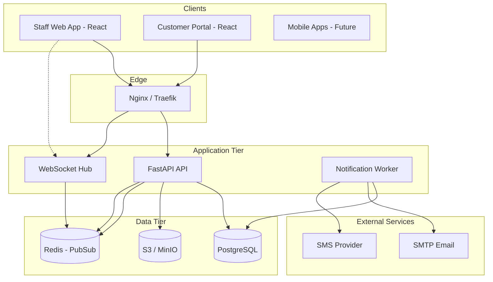
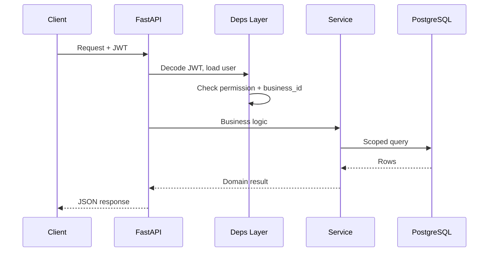

# System Architecture

## High-level diagram



## Component responsibilities

| Component | Responsibility |
|-----------|----------------|
| **React SPA** | Staff ERP UI + embedded portal routes |
| **FastAPI** | REST, auth, validation, orchestration |
| **WebSocket** | Real-time ticket/dashboard updates |
| **PostgreSQL** | System of record |
| **Redis** | WS fan-out across API replicas (scale) |
| **S3** | Photos, PDFs, receipts |
| **Worker** | Async email/SMS from `notification_log` |

## Request flow (authenticated)



## Backend layering

```
api/v1/*.py     → HTTP routing, status codes only
schemas/*.py    → Pydantic I/O contracts
services/*.py   → Transactions, rules, side effects
models/*.py     → SQLAlchemy entities
core/*.py       → Config, security, permissions
```

**Rules**

- No business logic in route handlers
- All DB access through services or repositories
- Side effects (email, WS broadcast) after commit

## Frontend architecture

```
pages/          → Route screens, data fetching
components/     → Presentational + shared widgets
hooks/          → Auth, WebSocket, React Query
lib/api.ts      → Typed API client
```

State: **TanStack Query** for server state; **Zustand** for UI ephemeral state (POS cart).

## Deployment (Docker Compose)

| Service | Port | Image |
|---------|------|-------|
| frontend | 5173 | Node build / Vite dev |
| api | 8000 | Python 3.12 |
| db | 5432 | postgres:16 |
| minio | 9000 | minio |
| redis | 6379 | redis:7 |

Production: separate compose overlay with TLS, managed RDS, S3, horizontal API replicas.

## Scalability path

1. **MVP:** Single API container, WS on same process
2. **Growth:** Redis pub/sub for WS; dedicated worker container
3. **SaaS:** Read replicas, CDN for frontend, per-tenant rate limits

## Technology decisions

| Decision | Rationale |
|----------|-----------|
| FastAPI | Async, OpenAPI native, Python ecosystem |
| PostgreSQL | ACID, JSONB settings, trigram search |
| JWT + refresh | Stateless API scaling; revocable refresh table |
| ShadCN | Accessible components, Tailwind consistency |
| S3-compatible | Vendor-neutral; MinIO for local dev |
