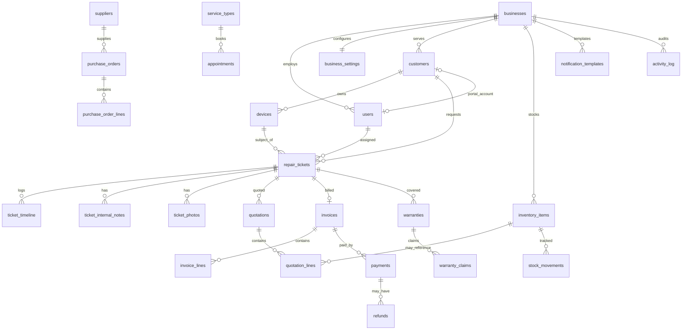

# Entity-Relationship Model

## ER diagram (core domain)

## Relationship summary

| Parent | Child | Cardinality | On delete |
|--------|-------|-------------|-----------|
| business | users | 1:N | CASCADE |
| business | customers | 1:N | CASCADE |
| customer | devices | 1:N | CASCADE |
| customer | repair_tickets | 1:N | RESTRICT |
| device | repair_tickets | 1:N | RESTRICT |
| repair_ticket | quotations | 1:N | CASCADE |
| repair_ticket | invoice | 1:0..1 | SET NULL |
| quotation | quotation_lines | 1:N | CASCADE |
| invoice | payments | 1:N | RESTRICT |

## Key constraints

- `repair_tickets(business_id, ticket_number)` UNIQUE
- `inventory_items(business_id, sku)` UNIQUE
- `users(business_id, email)` UNIQUE
- Ticket status transitions validated in application layer
- `quantity_on_hand` never negative (CHECK or service guard)

## Indexes (performance)

| Table | Index | Purpose |
|-------|-------|---------|
| repair_tickets | (business_id, status) | Dashboard filters |
| repair_tickets | (business_id, created_at DESC) | Recent list |
| customers | GIN trigram | Search |
| inventory_items | partial low stock | Alerts |
| activity_log | (business_id, created_at DESC) | Feed |
| appointments | (business_id, scheduled_start) | Calendar |

## Portal tracker mapping

| DB `ticket_status` | Customer tracker step |
|--------------------|------------------------|
| new | Received |
| diagnosing | Diagnosing |
| waiting_approval | Awaiting Approval |
| waiting_parts | Repairing |
| repairing | Repairing |
| testing | Testing |
| ready_for_pickup | Ready |
| completed | (hidden / archived) |
| cancelled | Cancelled banner |
